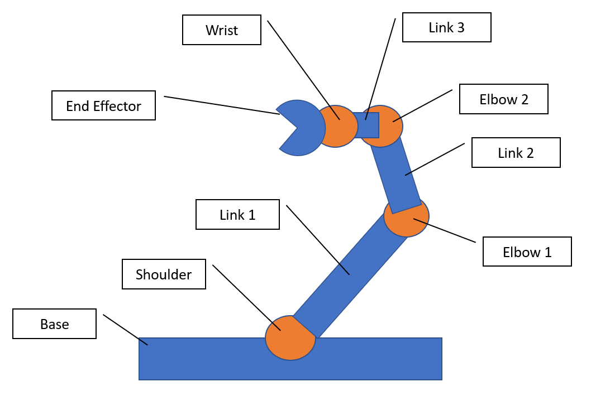

# Robot-Arm
This repo is for the Robot Arm project by the Viking Robotics Society.

## Introduction
The idea of this project is to build a 5-DOF Robot Arm that will be able to draw and manipulate tasks. This project is set out to be completed by the end of the Winter Term 2020. A backup deadline is Spring 2020.

## Terminology

## Current Progress

